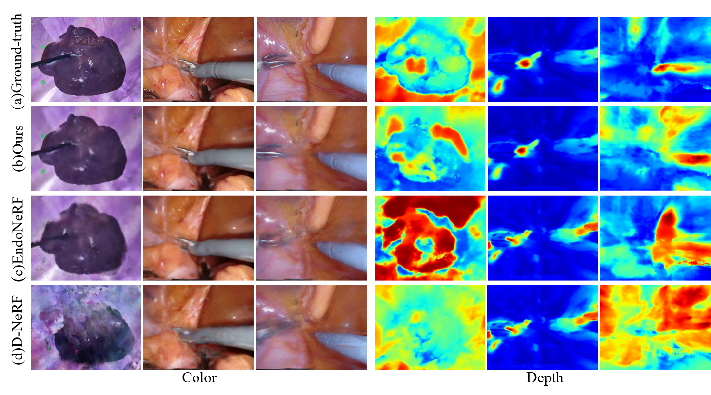
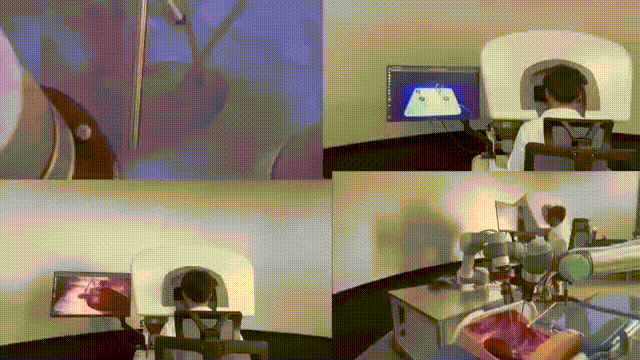
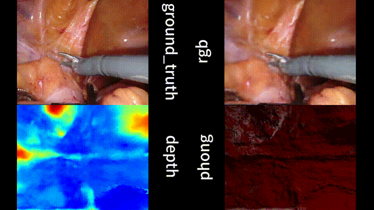
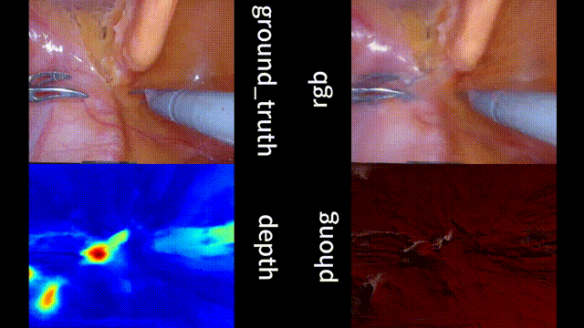
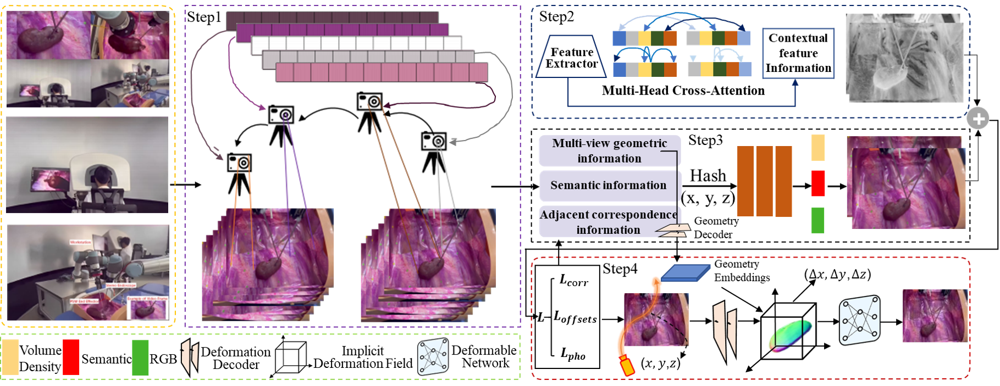

# Deforming reconstruction 

This is the official repository for the project "Multi-view Geometric and Semantic Information Fusion for High-Fidelity Deformable Reconstruction".We extend NeRF, a state-of-the-art method for photorealistic appearance and geometry reconstruction of a static scene, to dynamic/deforming/non-rigid Robot surgery scenes. For details, we refer to [(Multi-view Geometric and Semantic Information Fusion
for Deforming Reconstruction)] and [the project page](https://github.com/chenqi111/FuseMGS.git), which also includes supplemental videos.




### Installation

* git clone https://github.com/chenqi111/FuseMGS.git
* cd FuseMGS
* pip install -r requirements.txt
* (Optional) Install [Miniconda](https://docs.conda.io/en/latest/miniconda.html).
* Setup the conda environment `FuseMGS` (or install the requirements using `pip`):
We recommend to use /Python=3.8 /pytorch=1.12.1 /torchvision=0.13.0 /cudatoolkit=11.6.0 /cuda==11.6 /numpy=1.24.4/  RTX 3060 or RTX 3090 for training and evaluation. If you find some packages are missing, please install them manually.
```
(Optional)conda env create -f environment.yml
```
### Datasets prepare
The effectiveness of nonrigid surgical scene reconstruction is assessed by employing two different datasets in this paper. 
* The first dataset was experimentally acquired by placing pig organ (kidney, liver, lung) onto a model that simulated a human laparoscopic scene, as exemplified in first video. The production of deformations in the scene is the utilization of dVRK to manipulate  surgical robotic arm, for grasping and pulling the porcine tissue,as exemplified in second video. 


* The second dataset is a dataset of da Vinci robotic surgery. The dataset comprises 2 surgical scenes in [EndoNeRF](https://github.com/med-air/EndoNeRF?tab=readme-ov-file). Significant deformation of soft tissues was demonstrated, particularly a rapid pulling action that occurred during a brief 2-second interval. The second video sequence demonstrates the complex and topological changes that occur during the cutting of soft tissue. 


### Datasets
* 1.Our datasets:Download from [Google Drive](https://drive.google.com/drive/my-drive)
* 2.Public datasets:Download from [EndoNeRF](https://github.com/med-air/EndoNeRF?tab=readme-ov-file)
* To test our method on your own data, prepare a data directory organized in the following structure:
```
+ configs
	|default.txt
	|example_sequence.txt
+ data
    |+ example_sequence/
	|images
	|precomputed.json	           
    |+ TODO/
	|images
```
*if you want to get precomputed.json,you can refer "(Optional) Multi-View Data and Per-Camera Intrinsics"

### Datasets preprocessing
* For data loading and camera parameter estimation, we have included a dummy implementation that only works on the included example sequence. If you do not want to write your own implementation as specified at the end of this README, you can instead use the following programs and files:
* Install COLMAP.
* From [nerf-pytorch](https://github.com/yenchenlin/nerf-pytorch), use `load_llff.py` to replace the example version included in this repo.
* In `load_llff_data()`, replace `sc = 1. if bd_factor is None else 1./(bds.min() * bd_factor)` with `sc = 1./(bds.max() - bds.min())`
* From [LLFF](https://github.com/Fyusion/LLFF), copy from `llff/poses/` the three files `colmap_read_model.py`, `colmap_wrapper.py`, and `pose_utils.py` directly into `./llff_preprocessing` (replacing existing files).
* In `pose_utils.py` fix the imports by:
* Commenting out `import skimage.transform`,
* Replacing `from llff.poses.colmap_wrapper import run_colmap` with `from .colmap_wrapper import run_colmap`,
* Replacing `import llff.poses.colmap_read_model as read_model` with `from . import colmap_read_model as read_model`.
* (Optional) An installation of FFMPEG enables *automatic* video generation from images and frame extraction from video input.
```
conda install -c conda-forge ffmpeg
```

### Walkthrough With an Example Sequence

Having set up the environment, we now show an example that starts with a folder of just images and ends up with a fixed viewpoint re-rendering of the sequence. Please read the sections after this one for details on each step and how to adapt the pipeline to other sequences.

We first navigate into the parent folder (where `train.py` etc. lie) and activate the conda environment:
```
conda activate fusemgs
```
(Preprocess) We then determine the camera parameters:
```
python preprocess.py --input data/example_sequence/
```
(Training) Next, we train the model with the scene-specific config:
```
python train.py --config configs/example_sequence.txt
```
(Free Viewpoint Rendering) Finally, we synthesize a novel camera path:
```
python free_viewpoint_rendering.py --input experiments/experiment_1/ --deformations train --camera_path fixed --fixed_view 10
```
All results will be in the same folder, `experiments/experiment_1/output/train_fixed_10/`.

The results of non rigid surgical scenes are followed by (ground_truth, rgb, depth and phong):



### Training

The config file `default.txt` needs to be modified as follows:
* `rootdir`: An output folder that collects all experiments (i.e. multiple trainings)
* `datadir`: Recorded input sequence. Set to `PARENT_FOLDER` from the `Preprocess` section above
* `expname`: Name of this experiment. Output will be written to `rootdir/expname/`

Finally, start the training by running:
```
python train.py
```

**(Optional) Multi-View Data and Per-Camera Intrinsics**
import json
with open(PARENT_FOLDER + "image_to_camera_id_and_timestep.json", "w") as json_file:
    json.dump(image_to_camera_id_and_timestep, json_file, indent=4)

Example file content with one camera and two time steps:
```
{
    "image00000000.jpg": [
        "0",
        8
    ],
    "image00000001.jpg": [
        "0",
        9
    ]
}
```
To load multi-view data, please replace the call to `load_llff_data` in `train.py` with a call to `load_llff_data_multi_view` in the provided `load_llff.py`. Note that downsampling images by a factor is not implemented in `load_llff_data_multi_view`.

Furthermore, using multi-view data requires specifying per-camera intrinsics. In the implementation, the file `PARENT_FOLDER/calibration.json` contains both intrinsics and extrinsics. Note that this `calibration.json` file is not necessary for monocular setups. If you want to use per-image intrinsics for a monocular setup, treat it as a multi-view setup where each image has its own unique time step.

Example file content with one camera named `0`:
```
{
    "min_bound": 0.0,
    "max_bound": 2.0189487179595886,
    "0": {
        "translation": [
            -0.041070333333333334,
            1.1753333333333333,
            0.49935666666666667
        ],
        "rotation": [
            [
                0.0577962,
                -0.997661,
                -0.0364925
            ],
            [
                0.558001,
                0.00197212,
                0.829838
            ],
            [
                -0.827825,
                -0.0683243,
                0.55681
            ]
        ],
        "center_x": 2572.48,
        "center_y": 1875.78,
        "focal_x": 5363.46,
        "focal_y": 5363.46,
        "height": 3840,
        "width": 5120
    }
}
```

**Evaluation**

When using `fixed`, the code will compute the standard deviation across images to visualize the background stability and store the result in `standard_deviation.png`.

When using `input_recontruction`, the code will automatically evaluate the resulting renderings quantitatively against the groundtruth and store the result in `scores.json`. In order to optionally use [LPIPS](https://github.com/richzhang/PerceptualSimilarity) during evaluation, you can clone the required code (in the main folder):
```
git clone https://github.com/richzhang/PerceptualSimilarity
```


## Cite
```
@misc{lin2020nerfpytorch,
  title={NeRF-pytorch},
  author={Yen-Chen, Lin},
  howpublished={\url{https://github.com/yenchenlin/nerf-pytorch/}},
  year={2020}
}
@inproceedings{mildenhall2020nerf,
 title={NeRF: Representing Scenes as Neural Radiance Fields for View Synthesis},
 author={Ben Mildenhall and Pratul P. Srinivasan and Matthew Tancik and Jonathan T. Barron and Ravi Ramamoorthi and Ren Ng},
 year={2020},
 booktitle={ECCV},
}
```

## License

This code builds on the [PyTorch port by Yen-Chen Lin](https://github.com/yenchenlin/nerf-pytorch) of the [original NeRF code](https://github.com/bmild/nerf). Both are released under an MIT license. Several functions in `run_nerf_helpers.py` are modified versions from the [FFJORD code](https://github.com/rtqichen/ffjord), which is released under an MIT license. We thank all of them for releasing their code.

The framework of the methodology of this paper is as follows:


## Contact
If you have any question,please feel free to contact us.E-mail:cqi28280@gmail.com
